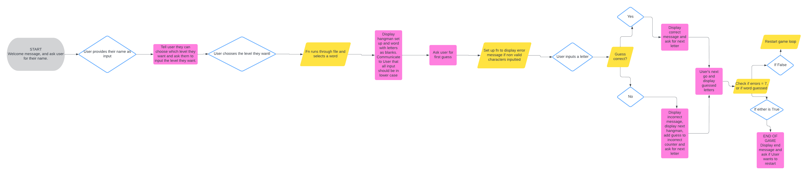
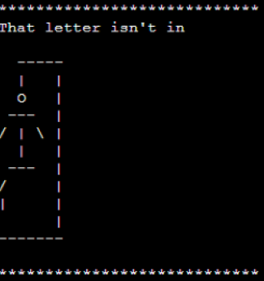

# **HANGMAN WORD GUESSING GAME**

# INTRODUCTION

This program is a digital version of Hangman, the popular game believed to have started in the 17th Century.

It is a Command Line Interface Application designed for a single User to play this classic game. It has three levels of difficulty and a random level, in which a word of any level can be picked.

The game was designed so that anyone can play it, from children to adults. The aim is to improve the User's vocabulary and spelling abilities in a way that is interactive and doesn't feel boring.

If you want to try it out, please follow the link below to access the application:

- [Hangman Game](https://hangman-game-joe-ortiz-bab2aa56a3ab.herokuapp.com/)

# CONTENTS

- [INTRODUCTION](#introduction)

- [CONTENTS](#contents)

- [USER EXPERIENCE](#user-experience)

  - [User's Stories](#user's-stories)

    - [Primary Goal](#primary-goal)
    - [Visitor Goals](#visitor-goals)
      - [Fimmlrst Time Visitors](#first-time-visitors)
      - [Returning Visitors](#returning-visitors)
      - [Frequent Visitors](#frequent-visiors)

  - [Creation Process](#creation-process)
    - [Planning](#planning)
    - [App Flowchart](#app-flowchart)
    - [App Structure](#app-structure)
    - [Python Logic](#python-logic)
  - [Design Choices](#design-choices)

- [FEATURES](#features)

  - [Outline](#outline)

  - [Main Features](#main-features)

    - [Welcome Message](#welcome-message)
    - [Instructions](#instructions)
    - [Difficulty Levels](#difficulty-levels)
    - [Game Process](#game-process)
    - [Choosing a Word & Displaying It To The User](#choosing-a-word--displaying-it-to-the-user)
    - [Processing The User's Guesses](#processing-the-users-guesses)
    - [Lives & Stickman Art](#lives--stickman-art)
    - [Game End & Rematch Request](#game-end--rematch-request)

  - [Future Features](#future-features)

- [TECHNOLOGIES USED](#technologies-used)

- [PYTHON PACKAGES](#python-packages)

- [TESTING](#testing)

- [PROJECT DEPLOYMENT](#project-deployment)

  - [Deployment to Heroku](#deployment-to-heroku)
  - [How to fork the repository from GitHub](#how-to-fork-the-repository-from-github)
  - [How to clone the project](#how-to-clone-the-project)

- [CREDIT](#credit)

  - [Content Credits](#content-credit)
  - [Media Credts](#media-credits)
  - [Acknowledgements](#acknowledgements)

# USER EXPERIENCE

## USER'S STORIES

### PRIMARY GOAL

The main goal this program was built for was to provide Users with a digital alternative to the Hangman game.

The main aim of the game is for Users to improve their spelling and vocabulary.

[Back to top](#contents)

### VISITOR GOALS

The application was created with the aim of being used as a game. Its use should feel simple and straightforwards, and instructions have been provided to ensure users feel confident they can use it without issues or difficulties.

The User can choose a difficulty level at the beginning, and once the game has completed they are asked if they want to replay. They are also able to choose a difficulty at this stage.

[Back to top](#contents)

#### FIRST TIME VISITORS

First time visitors will:

- Be able to add their name at the start

- Read the instructions before starting

- Know how many chances they have to guess the word (lives)

- Choose a difficulty level

- Guess a letter they think is in the word

- Depending on the outcome of the game they will get a different message

- Have the ability to play again if they want to

[Back to top](#contents)

#### RETURNING VISITORS

Returning visitors will see the same cues and messages as first time users.

The numbers for each level are always the same, so as soon as they type their name and press the Enter key they can choose the level they want without having to read the instructions again.

[Back to top](#contents)

#### FREQUENT VISITORS

A frequent visitor will be familiar with the structure and how the game works. They shouldn't feel the need to read through the instructions and should know which number corresponds to each level and how the game works.

[Back to top](#contents)

## CREATION PROCESS

### PLANNING

At the start of the project, there were a few different ideas I was considering. I made a list of the different ideas and set out a basic structure for each.

After doing some research into the different projects I had in mind, I decided to build a version of Hangman.

[Back to top](#contents)

### APP FLOWCHART

The flowchart was created using [Lucid Charts](https://www.lucidchart.com/pages/).

I followed the suggestions in the [Love Sandwiches Walkthrough](https://github.com/Code-Institute-Solutions/love-sandwiches-p5-sourcecode) and the first thing I did once I'd decided to build this Hangman game was create a flowchart.

I found it a very helpful tool to visualize the structure the application should have, and the logic it should follow.

[Back to top](#contents)

### APP STRUCTURE

The app structure is very simple as it was built to be a Command Line Interface Application.

[Back to top](#contents)

### PYTHON LOGIC

The logic used in this program is quite straightforward.

The User's response is validated whenever they are asked for input. If the input doesn't meet the requirements for the application to proceed the User will be shown a message prompting them to answer in a specific way.

Plenty of testing was done to ensure that the messages Users see are relevant and appropriate.

[Back to top](#contents)

## DESIGN CHOICES

The minimalist design used is due to it being built to be used in a Command Line Interface. The advantage here is that the structure is simple and easy for Users to understand and play.

ASCII characters were used on each of the Hangman drawings Users see if they get a letter wrong.

[Back to top](#contents)

# FEATURES

## OUTLINE

The game outline is as follows:

1. The User is greeted by the computer and asked for their name.

2. They are shown the instructions and asked their preferred difficulty level for the game.

3. The letters are swapped for underscores, and the User is shown the word and told how many letters are in it.

4. The User is prompted to guess a letter.

5. The User keeps getting asked to guess a letter until they guess all the letters, or they run out of lives.

6. Once the game ends the User is asked if they'd like to play again.

7. If they choose to play again they will have to choose their difficulty level and the game restarts.

[Back to top](#contents)

## MAIN FEATURES

### WELCOME MESSAGE

When a User starts the application they are greeted by the computer and asked to enter their name.

Only letters and numbers are allowed, so input validation checks for any special characters and ensures that a blank name isn't entered either. If the program encounters any characters which aren't accepted, the User will see a message asking them to only input letters and numbers.

The computer then displays a message using the name the User entered welcoming them to the game.

[Back to top](#contents)

### INSTRUCTIONS

Once the User has been welcomed, the display will load the instructions and ask them to choose a level of difficulty.

The program only accepts 1, 2, 3 or 4 as options at the Instructions stage, so if a User types anything else a message will ask them to choose an option betwen 1 and 4.

The input validation also takes into account any input that isn't numerical and in this case displays a different message asking for their input to be a number between 1 and 4.

[Back to top](#contents)

### DIFFICULTY LEVELS

There are three difficulty levels a User can choose from, as well as an option for a random word.

There are around 50 easy words, 50 medium words and 30 hard words in the hard level. So as to make the game more entertaining, a User could go for the random option which would choose a word that could be of any difficulty.

- The Easy words are between 3 and 5 letters long.

- The Medium difficulty words are between 5 and 9 letters long.

- The Hard words have at least 7 letters and are meant to present more of a challenge.

[Back to top](#contents)

### CHOOSING A WORD & DISPLAYING IT TO THE USER

Once the User has chosen the level they want, the application runs through the words in the corresponding file and selects one for them to guess.

Every letter in the word is then replaced with an underscore and this is displayed to the User along with a message telling them how many letters there are. They are then asked to enter their first guess.

[Back to top](#contents)

### PROCESSING THE USER'S GUESSES

Once the User has entered their guess the program will check whether that letter is in the word.

The application will also check that the input isn't blank or more than one character in length and asks the user to only input letters if their guess is a number or special character.

If the User's guess appears in the word the screen will display a message confirming their guess is right and a loop is ran which replaces the underscores with the letter.

When the Users are asked for their next guess they are shown the word which now includes the letter they last guessed.

If that letter isn't in the word, a message will tell them that it isn't in. The stickman is also shown at this stage with a message letting the User know how many chances they have left.

Each guess is added to a list which is displayed back to the User after each turn so they can see what letters they've guessed. However, if the same letter is entered more than once a message will appear to tell them that they've already tried it.

The process is repeated until the User runs out of chances, or they guess all the letters and the word is revealed.

[Back to top](#contents)

### LIVES & STICKMAN ART

The User can have up to seven incorrect guesses per game.

If they don't guess the word before running out of lives then they will see a message telling them what the word was, and ask them if they'd like to play again.

Each time an incorrect guess is entered the User is told that the letter isn't in. The stickman will also be displayed at this stage.

The stickman the User sees will depend on the lives they have left and was created using ASCII characters.

[Back to top](#contents)

### GAME END & REMATCH REQUEST

When the word has been guessed or the User has no more lives left, a message will ask the User if they'd like to play again.

Input validation checks the input and if it's anything other than "yes" or "no", another message is shown prompting the user to only use these.

If they don't want to play again the computer thanks them for playing and the application quits.

If they choose to have another game they will have to choose the level they want, and the game restarts.

[Back to top](#contents)

## FUTURE FEATURES

In future, I would like to add an option so that if a User thinks they know the word they can type it in instead of just entering one letter at a time. The idea is that this would be a form of "sudden death", which means that if their guess is wrong they will lose any remaining lives.

I will also be adding more words to each difficulty level.

I would also like to add more animations and will look into applying more ASCII designs.

[Back to top](#contents)

# TECHNOLOGIES USED

- [GitHub](https://github.com/) - Used to create and host the repository.

- [Heroku](https://heroku.com/) - Used to deploy and run the application.

- [Gitpod](https://gitpod.io/) - Used together with VS Code to build the application.

- [Visual Studio Code Desktop Application](https://code.visualstudio.com/) - Used to code and build the application.

- [CI Python Linter](https://pep8ci.herokuapp.com/) - Used to check and validate the code for the application.

- [Lucid Charts](https://www.lucidchart.com/pages/) - Used to create the initial flowchart for the application.

[Back to top](#contents)

# PYTHON PACKAGES

- [Random](https://docs.python.org/3/library/random.html) - Used to select a word for the User to guess.

[Back to top](#contents)

# TESTING

All testing results and documentation can be found in [TESTING.md](TESTING.md)

[Back to top](#contents)

# PROJECT DEPLOYMENT

## DEPLOYMENT TO HEROKU

The full application was deployed using the [Heroku Website](https://heroku.com/).

The steps taken to deploy the application were as follows:

1. Accessed the Heroku website and logged into my account. If you don't have an account you can follow [this link](https://signup.heroku.com/login) to create one.

2. On the dashboard click on "New", and then "Create new app".

3. I chose an app name (hangman-game-joe-ortiz), changed the region to "Europe" and clicked "Create app".

4. Once this is done, navigate over to the "Settings" section and click on "Reveal Config Vars". Enter "PORT" as the key, and "8000" as the value.

5. Still within the "Settings" section, look for Buildpacks and click on "Add Buildpack". The builpacks required were Python and Nodejs (_it's really important that Python is the first buildpack selected, although the order can be altered by clicking and dragging the buildpacks_).

6. Go back over to the "Deploy" section and link your GitHub account by clicking on the GitHub button. Sign in to your GitHub account if necessary, and once this is done type the name of the repository you want to deploy and search for it using the Search button. Once you've found it press "Connect". This will link the Heroku app to the code in GitHub.

7. There are two ways of finalising the application's deployment. At the bottom of the "Deploy" section, you will find an "Automatic deploys" and a "Manual deploy" subsection and you'll have to choose which method you'd prefer. The main difference between these options is that the Manual deploy option deploys the application by running the current code, however if any changes are made these will not be reflected until another Manual deploy is actioned. I've added links for further information about both of these options below.

   - [Heroku Automatic Deploys](https://devcenter.heroku.com/articles/github-integration#automatic-deploys)

   - [Heroku Manual Deploys](https://devcenter.heroku.com/articles/github-integration#manual-deploys)

8. On this occasion I chose the Automatic deploys option as it updates the application code automatically on Heroku every time a new commit is pushed through to GitHub.

9. Once the deployment has finished, a message will appear to confirm this above a button that says "view" which will take you to the deployed application.

10. Click on the "RUN PROGRAM" button on the top left and the application will run.

[Back to top](#contents)

## HOW TO FORK THE REPOSITORY FROM GITHUB

The steps required to fork [this repository](https://github.com/J95Ortiz/hangman-game) are listed below:

1. Follow the link above to locate my original repository.

2. In the code section, there is a button that says "Fork" located just above the "About" section.

3. Click on this button and the fork will be created.

[Back to top](#contents)

## HOW TO CLONE THE PROJECT

To clone this project follow the steps listed below:

1. Navigate over to [this repository](https://github.com/J95Ortiz/hangman-game) and click on the green "Code" button located next to "Add file".

2. From the dropdown copy the URL link. This can be done using the copy button next to the link or by highlighting it and copying it.

3. Within the IDE open Git Bash, and change the working directory's location to the one you want to work off, at which point the cloned directory will be created.

4. Type "git clone", and paste the URL copied in step 1 and the clone will be created.

[Back to top](#contents)

# CREDIT

## CONTENT CREDIT

I used the following resources to assist me when building the Hangman game:

- [Build a Hangman Game for the Command Line in Python](https://realpython.com/python-hangman/)

- [Word Guessing game video](https://www.youtube.com/watch?v=N_6YIClAor0), and their [GitHub Repository](https://github.com/portfoliocourses/python-example-code/blob/main/word_guessing_game.py)

- [How to Create a Hangman Game Using Python](https://www.makeuseof.com/python-game-hangman-create/?utm_source=flipboard&utm_content=topic%2Fadventuregame), and their [GitHub repository](https://github.com/makeuseofcode/Hangman-Game/blob/main/hangman.py)

[Back to top](#contents)

## MEDIA CREDITS

- The design for the ASCII characters was obtained from this repository(https://github.com/realpython/materials/blob/master/hangman-tui/source_code/hangman.py) linked to the Real Python article mentioned in the previous section but their order was reversed so as to work correctly with my code.

[Back to top](#contents)

## ACKNOWLEDGEMENTS

I would like to mention my Mentor, [Precious Ijege](https://www.linkedin.com/in/precious-ijege-908a00168/) for his support and feedback during the building process. His suggestions and comments on the application and how to improve it helped me have the confidence to go further and test my knowledge.

A further acknowledgement to [Lucia](https://github.com/lucia2007) as her [README.md](https://github.com/lucia2007/towers-of-hanoi/blob/main/README.md) file was a great tool to help me set out the structure for mine.

I would also like to add a further thank you to the Student Support Team at Code Institute for their assistance so far on the course.

[Back to top](#contents)
